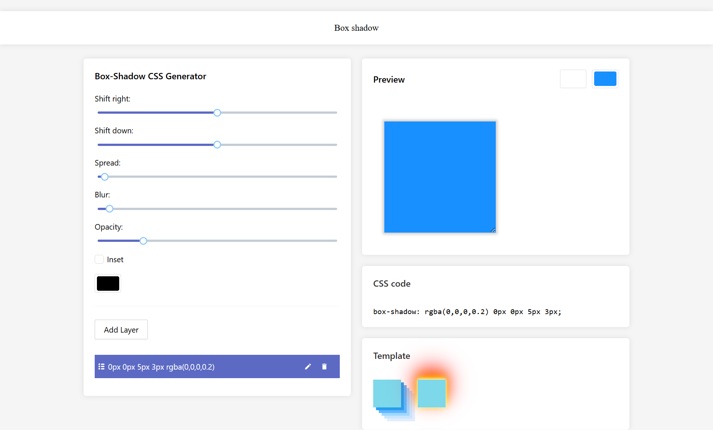
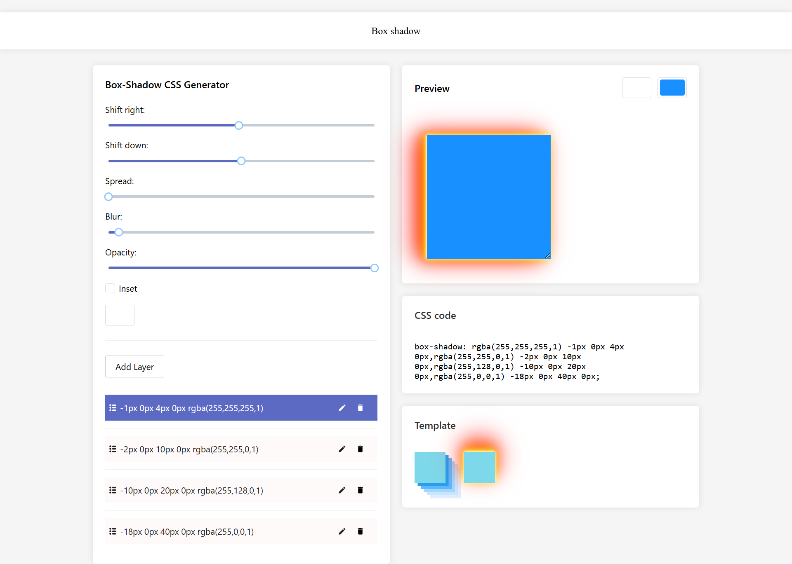
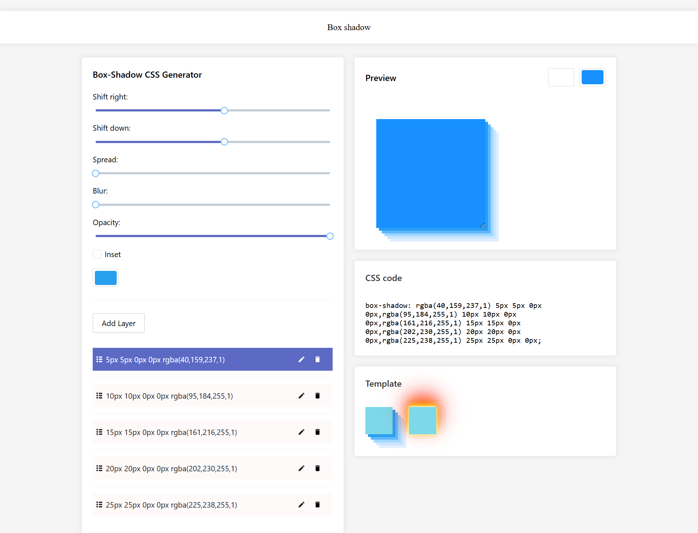

# `create-preact`

<h2 align="center">
  
</h2>

<h3 align="center">Project using Preact + Vite, immer, teaful, react-icons and Ant Design!</h3>

## Preview of the Application
# `create-preact`

<h2 align="center">
  
</h2>

<h3 align="center">Get started using Preact and Vite!</h3>

## Preview of the Application

Here are some screenshots of the application:

- **Screenshot 1**
  

- **Screenshot 2**
  

- **Screenshot 3**
  

## Getting Started

Follow these steps to get the application up and running on your local machine:

1. **Clone the repository:**

    ```bash
    git clone <repository-url>
    cd <repository-directory>
    ```

2. **Install dependencies:**

    ```bash
    npm install
    ```

3. **Run the development server:**

    ```bash
    npm run dev
    ```

    This will start a local development server at [http://localhost:5173/](http://localhost:5173/).

4. **Build for production:**

    ```bash
    npm run build
    ```

    This will create an optimized production build in the `dist/` directory.

5. **Preview production build:**

    ```bash
    npm run preview
    ```

    This starts a server at [http://localhost:4173/](http://localhost:4173/) to preview the production build locally.

## Additional Resources

- [Preact Documentation](https://preactjs.com/)
- [Vite Documentation](https://vitejs.dev/)

Here is a screenshot of the application:


## Getting Started

Follow these steps to get the application up and running on your local machine:

1. **Clone the repository:**

    ```bash
    git clone <repository-url>
    cd <repository-directory>
    ```

2. **Install dependencies:**

    ```bash
    npm install
    ```

3. **Run the development server:**

    ```bash
    npm run dev
    ```

    This will start a local development server at [http://localhost:5173/](http://localhost:5173/).

4. **Build for production:**

    ```bash
    npm run build
    ```

    This will create an optimized production build in the `dist/` directory.

5. **Preview production build:**

    ```bash
    npm run preview
    ```

    This starts a server at [http://localhost:4173/](http://localhost:4173/) to preview the production build locally.

## Additional Resources

- [Preact Documentation](https://preactjs.com/)
- [Vite Documentation](https://vitejs.dev/)

## By

**Nguyen Thanh Dat**